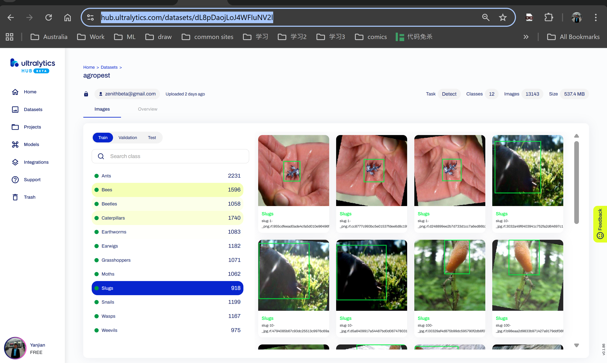
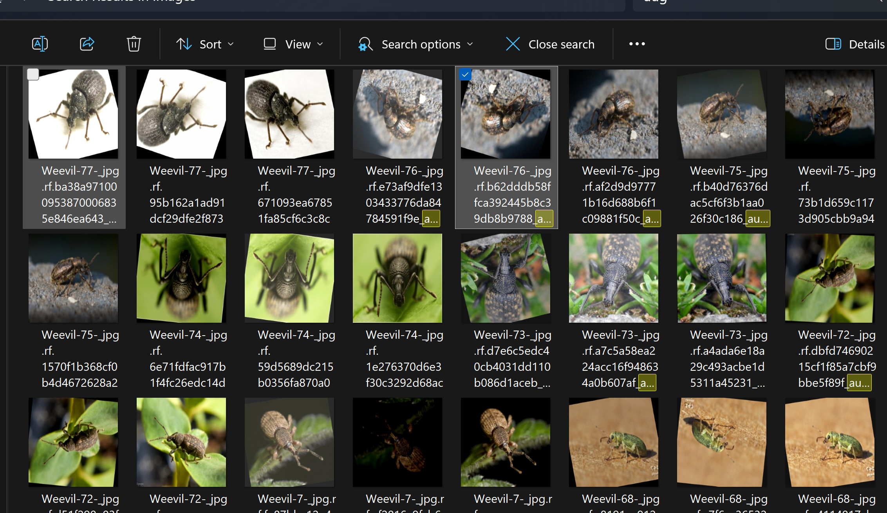
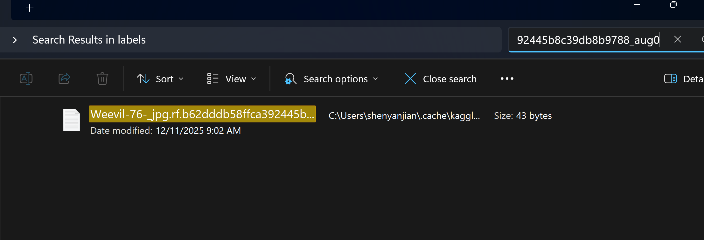
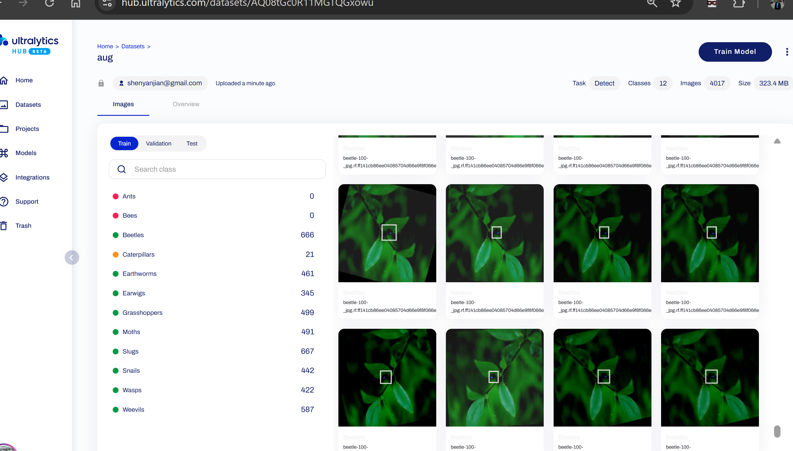
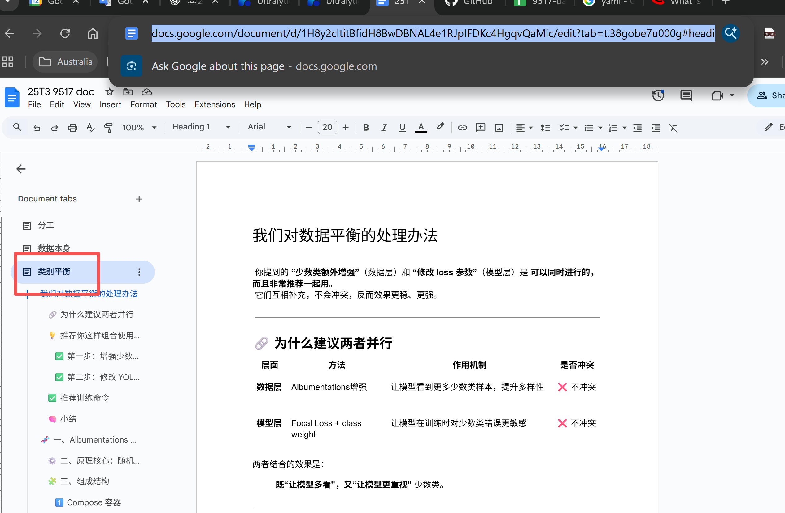
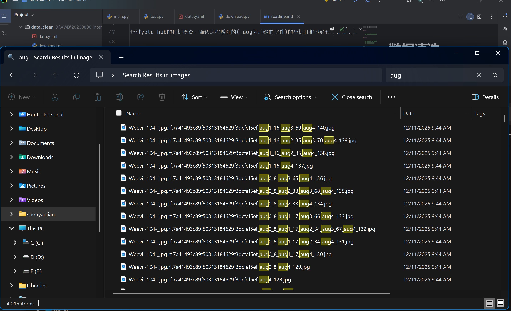
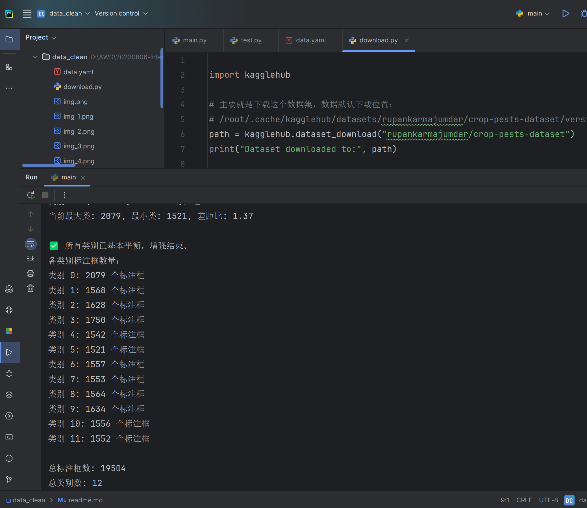

本脚本基于10 Nov 2025我们合作进行数据清理，对"rupankarmajumdar/crop-pests-dataset"数据集进行**数据预处理步骤**。

# 环境准备

    pip install albumentations kagglehub

# 如何下载数据

    pip install -U pip setuptools wheel
    pip install kagglehub

```
import kagglehub

path = kagglehub.dataset_download("rupankarmajumdar/crop-pests-dataset")
# 打印已下载路径
print("Dataset downloaded to:", path)
```

Linux 数据集默认下载位置：

    /root/.cache/kagglehub/datasets/rupankarmajumdar/crop-pests-dataset/versions/2/

Windows 数据集默认下载位置：

    C:\Users\{USER_NAME}\.cache\kagglehub\datasets\rupankarmajumdar\crop-pests-dataset\versions\2\

如果之后自己处理数据，导致数据乱了，希望重新下载数据

删除`# /root/.cache/kagglehub/datasets/rupankarmajumdar/crop-pests-dataset/versions/2/`注意要删除掉这个`/2/`目录，然后运行`download.py`。 这样就可以获取重新的数据。

# 类别平衡

刘已经上传图像集到yolo hub: `https://hub.ultralytics.com/datasets/dL8pDaojLoJ4WFIuNV2l`,可供查看打标参考

如图所示，如下数量代表打框数量（非图片数量），可见不平衡



经过类别处理：少数类额外增强 后，会有`Weevil-76-_jpg.rf.b62dddb58ffca392445b8c39db8b9788_aug0.jpg`的带`aug0`的图片名字





我自己对**完成后的本脚本**进行了检查，已确认经过yolo hub的打标检查，确认这些增强的(_aug为后缀的文件)的坐标打框也经过了正确变换，不用担心我的程序错误打标问题。

如图所示，是我专门整理出aug的图片进行检查，可见打框坐标随着原始图像变换，box坐标也进行了正确变换




# 增强

增强原理用到 **albumentations**，具体可以参考团队doc的内容，通过旋转、改变光照等方式，对图像、label进行处理。



因为动态每轮20%步长对少数类别进行增强，最终控制最少数量和最大数量倍差不超过1.4，就视为平衡

因为有可能会出现“aug后再aug”，因此图片路径（包括img和label）都可能出现如下的这种多个`aug`后缀



# 数据清洗

配置项参考
1. main.py的main函数
2. data.yaml

脚本运行完毕后，类别会基本平衡




